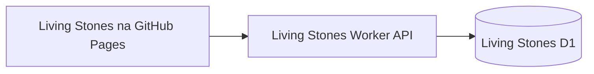

# Living Stones: návrh prvého backendu

Stav: návrh na schválenie. Cloudflare zdroje ani databáza zatiaľ nie sú vytvorené. Živá stránka: https://romanduris.github.io/LivingStones/.

## Odporúčané zapojenie

Prvú fázu odporúčam postaviť na súčasnom GitHub Pages frontende, samostatnom Cloudflare Worker API a D1 databáze. Zachováme vzhľad, mapy, mobilný tok nálezu aj adresy `?stone=A1`. Existujúci `stoneRepository` zmeníme na asynchrónne čítanie a zápis cez API.

Prehliadač komunikuje iba s API. Worker má priamy binding `DB` na konkrétne UUID Living Stones databázy; Cloudflare API token nebude súčasťou stránky. [D1 a bindingy](https://developers.cloudflare.com/d1/get-started/).

Prvé API môže používať adresu na `workers.dev`. CORS povolí súčasný pôvod stránky `https://romanduris.github.io`; CORS nie je overovanie oprávnenia na zápis. Vlastnú doménu alebo presun frontendu na Cloudflare môžeme riešiť následne. Cloudflare podporuje aj spoločné nasadenie statických súborov a API do jedného Workeru. [Workers Static Assets](https://developers.cloudflare.com/workers/static-assets/).

## Oddelenie od BTSflighttickets

| Zdroj                           | Prvé testovacie prostredie | Neskoršia produkcia       |
| ------------------------------- | -------------------------- | ------------------------- |
| Worker                          | `livingstones-api-test`    | `livingstones-api`        |
| D1 databáza                     | `livingstones-test-db`     | `livingstones-db`         |
| GitHub prostredie pre nasadenie | `livingstones-test`        | `livingstones-production` |

Living Stones bude mať vlastnú Wrangler konfiguráciu, migrácie, deployment tokeny a databázové bindingy v tomto repozitári. BTSflighttickets zdroje nebudú súčasťou jeho konfigurácie. Opätovné nasadenie alebo seed nevynuluje pridané komentáre ani nálezy; seed bude opakovateľný bez duplicít.

Oba projekty môžu byť v jednom Cloudflare účte. Názvy a samostatné databázy zabezpečia logické oddelenie; rozsah API tokenu treba nastaviť samostatne. Limity a fakturácia účtu sa tým neoddelia. Pre izoláciu celého účtu by bol potrebný samostatný Cloudflare account.

## Databáza a používateľské správanie

| Tabuľka    | Obsah                                                                                         |
| ---------- | --------------------------------------------------------------------------------------------- |
| `stones`   | ID, meno, príbeh, narodenie, krajina pôvodu, obrázok, `is_demo`, serverové overenie Find Code |
| `finds`    | Stone ID, čas nálezu, súradnice, presnosť GPS, mesto, krajina, adresa a označenie testu       |
| `comments` | Stone ID, voliteľné Find ID, prezývka, text a čas pridania                                    |

Do testovacej databázy vložíme existujúcich 5 demo kamienkov, 25 historických nálezov a ich poznámky. Označenie Demo zostane zachované. Obrázky zatiaľ zostanú existujúcimi SVG súbormi; úložisko pre nahrávanie fotografií nie je potrebné pre tento krok.

- Prehľad a detail načítajú dáta z API; demo dáta prestanú byť zdrojom pravdy stránky.
- Otvorenie kameňa nevytvorí nález.
- Mobilný potvrdený nález s kódom a polohou uloží nález a jeho prípadnú poznámku. Až po úspešnom zápise ukáže úspech a aktualizuje mapu, históriu a počty.
- Samostatný komentár môže byť bez nového nálezu: nepridá bod na mapu, nezvýši počet nálezov a neobnoví Alive. Zobrazí sa v komentároch a Last Comment.
- Alive zostane odvodené od posledného nálezu v posledných 90 dňoch.
- Dáta zostanú po refreshi a budú viditeľné aj z iného zariadenia. Pri chybe API stránka ukáže chybu alebo ponúkne opakovanie, nebude predstierať úspešné uloženie.

Navrhované API: `GET /api/stones`, `GET /api/stones/:id`, `POST /api/stones/:id/finds`, `POST /api/stones/:id/comments`. Worker overí Find Code, súradnice a dĺžky vstupov; použije parametrizované SQL, obmedzenie zápisov a idempotency ID proti duplicitám pri opakovaní požiadavky. Samostatný komentár bude tiež vyžadovať Find Code. Pre reálne kamene nebude kód uložený vo verejných dátach frontendu.

## Prístup na konfiguráciu

Potrebné budú Cloudflare Account ID a samostatný API token pomenovaný pre Living Stones. Účet možno vybrať v token policy. Vytvorenie nového Workeru vyžaduje oprávnenie na vytváranie Workers; nasadenie existujúceho Workeru môže používať Editor obmedzený na konkrétny Worker. D1 vytvorenie a migrácie vyžadujú príslušný zápisový prístup. Presný rozsah D1 policy overíme v účte pred použitím tokenu; produktový rozsah sa nemá považovať za obmedzenie na jednu databázu. [Workers oprávnenia](https://developers.cloudflare.com/workers/authorization/), [D1 API oprávnenia](https://developers.cloudflare.com/fundamentals/api/reference/permissions/).

Token sa vytvára v My Profile → API Tokens alebo Manage Account → API Tokens. Nastavíme len potrebné produkty a vybraný účet. Po vytvorení zdrojov môžeme zúžiť oprávnenia nasadzovacieho tokenu na konkrétny Worker. [Vytvorenie tokenu](https://developers.cloudflare.com/fundamentals/api/get-started/create-token/).

Token ulož používateľsky ako GitHub Codespaces secret `CLOUDFLARE_API_TOKEN` prístupný tomuto repozitáru; Account ID sprístupni ako `CLOUDFLARE_ACCOUNT_ID`. Po obnovení prostredia ich môže používať Wrangler. Pre automatické nasadzovanie neskôr vytvoríme osobitné GitHub Actions secrets/prostredie. Token ani heslo neposielaj do chatu a nevkladaj do repozitára. Po sprístupnení a schválení implementácie viem vykonať vytvorenie zdrojov, migrácie, seed, nasadenie a overenie.

## Postup a overenie

1. Pripraviť Worker, API kontrakt, SQL migrácie a opakovateľný seed v repozitári; otestovať lokálnu D1 databázu.
2. Overiť účet a rozsah tokenu, vytvoriť samostatný testovací Worker a D1 databázu, nastaviť binding a aplikovať migrácie.
3. Načítať demo dáta z D1 a pripojiť frontend cez API. Upraviť texty „preview / this visit only“ podľa skutočného trvalého ukladania.
4. Pridať testovací komentár aj mobilný nález; overiť ich po refreshi a z druhého prehliadača, nový bod na mape a správne počty. Zopakovaný zápis nesmie vytvoriť duplikát.
5. Overiť, že ďalšie nasadenie alebo opakovanie seedu zachová pridané údaje. Až potom pripraviť produkčné prostredie a prípadnú vlastnú doménu.

D1 má aj Free plán, ktorý je vhodným východiskom na tento malý test. Pred nasadením treba skontrolovať plán a existujúce využitie účtu, keďže v ňom už beží BTSflighttickets. [Aktuálne D1 ceny a limity](https://developers.cloudflare.com/d1/platform/pricing/).
