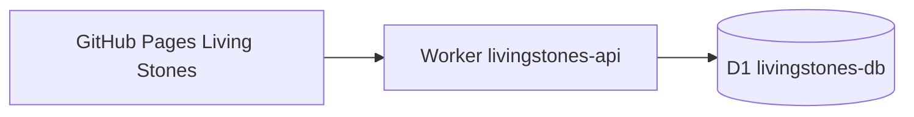

# Living Stones: produkčné zapojenie

Stránka: https://romanduris.github.io/LivingStones/.

Používateľ potvrdil produkčné názvy a trvalé ukladanie. Nie je potrebné neskôr premenovávať alebo presúvať testovaciu databázu.

- Worker: `livingstones-api`, https://livingstones-api.livingstones-romanduris.workers.dev.
- D1: `livingstones-db`, vytvorená s jurisdikciou EU.
- Produkčný binding `DB`, UUID a pôvod frontendu: `wrangler.jsonc`.
- Lokálna konfigurácia a databáza: `wrangler.local.jsonc`. Žiadne vzdialené testovacie prostredie.
- Tabuľky `stones`, `finds`, `comments`, `submissions` a `rate_limits`.
- Seed: 5 kamienkov s `is_demo = 1`, 25 nálezov a ich poznámok. Opätovný seed zachová nové záznamy.
- Reálne kamene: `is_demo = 0`, označenie Real; Find Code sa nezverejňuje.

Prehliadač neobsahuje Cloudflare API token. Komunikuje s verejným Worker API; Worker pristupuje priamo k určenej D1 databáze. [D1 bindingy](https://developers.cloudflare.com/d1/get-started/).

Nález s kódom a polohou sa uloží spolu s poznámkou v jednej transakcii. Komentár bez nálezu nemení mapu ani Alive. Alive ostáva 90 dní od posledného nálezu. Otvorenie alebo zdieľanie odkazu nikdy nezapisuje nález. Identifikátor požiadavky chráni pred duplicitami pri opakovaní odoslania.

BTSflighttickets sa nemení: má vlastné zdroje, Living Stones vlastné Worker/D1 bindingy a migrácie. Ide o logické oddelenie v jednom účte; account limity a fakturácia zostávajú spoločné. Aktuálny API token má oprávnenia pre vybraný account, takže samotné názvy zdrojov nepredstavujú hranicu oprávnení tokenu. [Workers oprávnenia](https://developers.cloudflare.com/workers/authorization/).

Nasadenie API a migrácií je cez Wrangler. Publikovanie frontendu zostáva cez GitHub Pages. Konkrétne príkazy, lokálne testovanie a zoznam endpointov sú v [README.md](README.md). Migrácie sa pridávajú ako nové súbory; existujúce záznamy sa pri nasadení nenulujú. [D1 migrácie a príkazy](https://developers.cloudflare.com/d1/wrangler-commands/).

Pridávanie nových skutočných kameňov, administrácia, nahrávanie fotografií a prípadná vlastná doména sú ďalšie samostatné kroky. Databázový model a rozhranie už rozlišujú Demo a Real.
